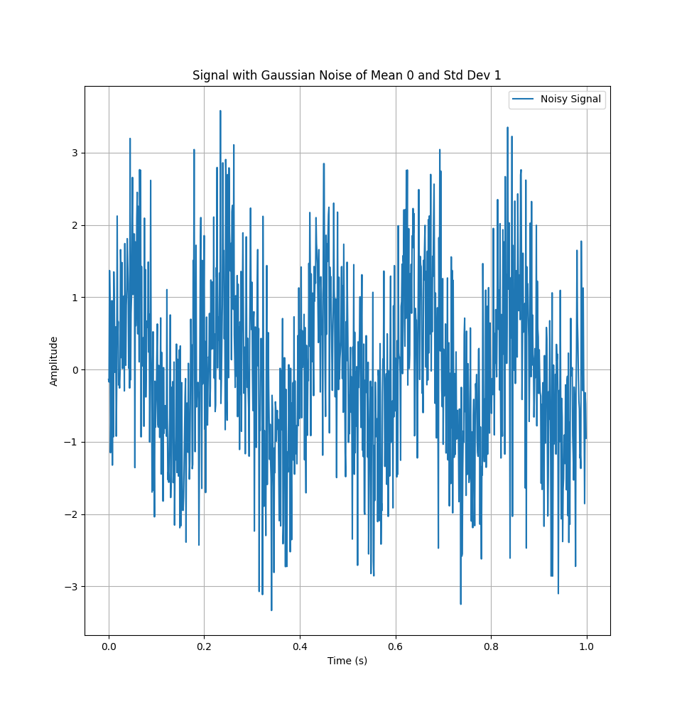

# // Narendhar T S
 Documenting my learnings

# Aim

- ## Perform the following operations in code:
	- Create a sine wave
	- Plot the wave
	- Apply PSD (power spectral density?) and plot the frequency graph
	- Add 2-3 sine waves and repeat the process
	- Apply noise to the signal and repeat the process

---
# Environment Setup
I decided to use Python to create the wave signals. In Python, the following modules are used:
- `numpy` - for creating and representing the sine waves using their equation
- `matplotlib` - for visualizing and plotting the wave equations

---
# Creating a sine wave
In theory, a sine wave is defined for every instant in time. But this means the equation is defined for infinitely many points in time.

Therefore it is not possible to create a continuous wave equation that is defined at all points. So, in numpy, we generate the wave by sampling it at specific intervals. 

For simplicity, I will use 1000 Hz to be the sampling rate here forth.

```python
t = np.linspace(0, 1, 1000, endpoint=False)
```

The above code creates an array of 1000 floats, linearly ranging from 0 to 1 (not included).
Our wave equation will be defined at these points.

Now, we can create a sine wave of amplitude 1 and frequency 5 Hz, over a period of 1 second. We also plot the wave using matplotlib.

```python
import numpy as np
import matplotlib.pyplot as plt

t = np.linspace(0, 1, 1000, endpoint=False)

signal = 1 * np.sin(2 * np.pi * 5 * t)
# y = A * sin(2 * pi * f * t)

plt.plot(t, signal)
plt.show()
```

Output:


---
# Creating multiple waves

| name    | amplitude | frequency (Hz) |
| ------- | --------- | -------------- |
| signal  | 1         | 5              |
| signal2 | 2         | 10             |
| signal3 | 0.5       | 20             |
```python
import numpy as np
import matplotlib.pyplot as plt

t = np.linspace(0, 1, 1000, endpoint=False)

signal = 1 * np.sin(2 * np.pi * 5 * t)
signal2 = 2 * np.sin(2 * np.pi * 10 * t)
signal3 = 0.5 * np.sin(2 * np.pi * 20 * t)

plt.plot(t, signal, label='5 Hz, Amplitude 1')
plt.plot(t, signal2, label='10 Hz, Amplitude 2')
plt.plot(t, signal3, label='20 Hz, Amplitude 0.5')

plt.legend()
plt.grid(True)
plt.title("Multiple Sine Waves")
plt.xlabel("Time (s)")
plt.ylabel("Amplitude")
plt.show()
```
Output:


# Power Spectral Density (PSD)

Power Spectral Density of a wave describes how the power of a signal is distributed over frequency.
It tells us which frequencies in a signal carry the most energy

So, a pure 5 Hz signal should have its all of its power concentrated on 5 Hz band.

---
## Welch's Method
Welch's method, named after Peter D. Welch, is an approach for spectral density estimation. It is used to estimate the power of a signal at different frequencies (Power Spectral Density)

In Python, it is available using the `scipy` module:
```python
from scipy.signal import welch

# signal: the time series wave
# sampling_rate: sampling rate of the wave
freqs, psd = welch(signal, sampling_freq)
```

So, using Welch's method on a pure 5 Hz wave, we get this output:
```python
import numpy as np
import matplotlib.pyplot as plt
from scipy.signal import welch

t = np.linspace(0, 1, 1000, endpoint=False)
signal = 1 * np.sin(2 * np.pi * 5 * t)

freqs, psd = welch(signal, 1000)

plt.plot(freqs, psd)
plt.title("PSD using Welch's method")
plt.xlabel("Frequency [Hz]")
plt.ylabel("Power")
plt.grid(True)
plt.show()
```


As expected, we see a spike near 0, at 5 Hz.

---
## PSD of multiple waves using Welch's method

Here is the graph of the resultant signal:


Now, we'll find the PSD of this wave using Welch's method:

```python
import numpy as np
import matplotlib.pyplot as plt
from scipy.signal import welch

t = np.linspace(0, 1, 1000, endpoint=False)

signal = 1 * np.sin(2 * np.pi * 5 * t)
signal2 = 2 * np.sin(2 * np.pi * 10 * t)
signal3 = 0.5 * np.sin(2 * np.pi * 20 * t)

resultant = signal + signal2 + signal3
  
freqs, psd = welch(resultant, 1000)
mask = freqs <= 40

plt.plot(freqs[mask], psd[mask])
plt.grid(True)
plt.title("PSD of 3 signals using Welch's method (nperseg=None)")
plt.xlabel("Frequency (Hz))")
plt.ylabel("Power")
plt.show()
```


`resultant` waveform is a signal which comprises of 3 signals as stated previously.

The PSD of this signal yields the above figure. 
We can see spikes in the neighbourhood of 5, 10 and 20 but they are not accurate. 

If we were given this PSD, we will not be able to say that 3 waves of 5, 10 and 15 had been used.

I will now try to use FFT directly instead to see if the results are any better.

---
## PSD of multiple waves using raw FFT

```python
import numpy as np
import matplotlib.pyplot as plt
from scipy.signal import welch

t = np.linspace(0, 1, 1000, endpoint=False)
  
signal = 1 * np.sin(2 * np.pi * 5 * t)
signal2 = 2 * np.sin(2 * np.pi * 10 * t)
signal3 = 0.5 * np.sin(2 * np.pi * 20 * t)

resultant = signal + signal2 + signal3

fft_result = np.fft.fft(resultant)
psd = np.abs(fft_result) ** 2 / len(resultant)
freqs = np.fft.fftfreq(len(resultant), 1/1000)
# freqs, psd = welch(resultant, 1000)

mask = (freqs > 0) & (freqs < 40)

plt.plot(freqs[mask], psd[mask])
plt.legend()
plt.grid(True)
plt.title("PSD of 3 signals using FFT")
plt.xlabel("Frequency (Hz))")
plt.ylabel("Power")
plt.show()
```


This looks a lot better.
We can clearly say which frequencies the result wave is comprising of.

--- 
## Finding why Welch didn't work
The way Welch's method works, it splits the signal into segments, applies FFT and averages the results.
While experimenting, I tuned the `nperseg` parameter to 1000 instead, and got this output:

```python
import numpy as np
import matplotlib.pyplot as plt
from scipy.signal import welch

t = np.linspace(0, 1, 1000, endpoint=False)

signal = 1 * np.sin(2 * np.pi * 5 * t)
signal2 = 2 * np.sin(2 * np.pi * 10 * t)
signal3 = 0.5 * np.sin(2 * np.pi * 20 * t)

resultant = signal + signal2 + signal3

freqs, psd = welch(resultant, 1000, nperseg=1000)

mask = freqs <= 40

plt.plot(freqs[mask], psd[mask])
plt.legend()
plt.grid(True)
plt.title("PSD of 3 signals using Welch's method (nperseg=1000)")
plt.xlabel("Frequency (Hz))")
plt.ylabel("Power")
plt.show()
```


Great.

---
# Analyzing Noisy Signals

Now, we will analyze the PSD of signals with artificially added random noise.

## Generating Noise

It is easy to generate noise sampled from Gaussian distribution.
```python
import numpy as np

noise = np.random.normal(0, 0.1, 1000)
```

This generates random noise with a mean of 0, standard deviation of 1000 at the size of 1000.

## Noisy Pure Signal

```python
import numpy as np
import matplotlib.pyplot as plt
from scipy.signal import welch
  
t = np.linspace(0, 1, 1000, endpoint=False)

signal = 1 * np.sin(2 * np.pi * 5 * t)
# signal2 = 2 * np.sin(2 * np.pi * 10 * t)
# signal3 = 0.5 * np.sin(2 * np.pi * 20 * t)  
# resultant = signal + signal2 + signal3

noise = np.random.normal(0, 0.1, 1000)
noisy_signal = signal + noise

# plt.plot(t, signal, label="Original Signal")
plt.plot(t, noisy_signal, label="Noisy Signal")
plt.legend()
plt.grid(True)
plt.title("Signal with added Random Gaussian Noise")
plt.xlabel("Time (s)")
plt.ylabel("Amplitude")
plt.show()
```


This looks very close to the original pure signal. 

So, we'll try increasing the standard deviation of the noise.

Increasing the standard deviation to 1 instead, we get:



This is a lot better.

## Applying PSD

```python
import numpy as np
import matplotlib.pyplot as plt
from scipy.signal import welch

t = np.linspace(0, 1, 1000, endpoint=False)

signal = 1 * np.sin(2 * np.pi * 5 * t)
# signal2 = 2 * np.sin(2 * np.pi * 10 * t)
# signal3 = 0.5 * np.sin(2 * np.pi * 20 * t)
# resultant = signal + signal2 + signal3

noise = np.random.normal(0, 1, 1000)
noisy_signal = signal + noise

freqs, psd = welch(noisy_signal, 1000, nperseg=1000)
freqs_pure, psd_pure = welch(signal, 1000, nperseg=1000)

mask = freqs < 40

plt.plot(freqs[mask], psd[mask], label="Noisy Signal PSD")
plt.plot(freqs_pure[mask], psd_pure[mask], label="Pure Signal PSD")
plt.legend()
plt.grid(True)
plt.title("PSD of pure signal with added noise")
plt.xlabel("Frequency (Hz)")
plt.ylabel("Power")
plt.show()
```


I have also plotted the noiseless pure signal's PSD along with the noisy signal's PSD.

We are able to ignore the noise and determine the frequency of the signal pretty accurately.

Let's try the FFT method:
```python
import numpy as np
import matplotlib.pyplot as plt
from scipy.signal import welch

t = np.linspace(0, 1, 1000, endpoint=False)

signal = 1 * np.sin(2 * np.pi * 5 * t)
# signal2 = 2 * np.sin(2 * np.pi * 10 * t)
# signal3 = 0.5 * np.sin(2 * np.pi * 20 * t)

# resultant = signal + signal2 + signal3
noise = np.random.normal(0, 1, 1000)
noisy_signal = signal + noise

# freqs, psd = welch(noisy_signal, 1000, nperseg=1000)
fft_result = np.fft.fft(noisy_signal)
psd = np.abs(fft_result) ** 2 / len(noisy_signal)
freqs = np.fft.fftfreq(len(noisy_signal), 1/1000)

# freqs_pure, psd_pure = welch(signal, 1000, nperseg=1000)
fft_result_pure = np.fft.fft(signal)
psd_pure = np.abs(fft_result_pure) ** 2 / len(signal)
freqs_pure = np.fft.fftfreq(len(signal), 1/1000)

mask = (freqs > 0) & (freqs < 40)

plt.plot(freqs[mask], psd[mask], label="Noisy Signal PSD")
plt.plot(freqs_pure[mask], psd_pure[mask], label="Pure Signal PSD")
plt.legend()
plt.grid(True)
plt.title("PSD of pure signal with added noise using FFT")
plt.xlabel("Frequency (Hz)")
plt.ylabel("Power")
plt.show()
```


Pretty accurate.

## Analysis of Noisy Resultant Wave


Let us use this resultant wave (comprising of three signals- at 5, 10 and 20 Hz each)

Applying random Gaussian noise of standard deviation 1, we get:


This is not enough...

Let's try increasing the randomness by adding random noise to each of the signal before adding them.


Better.

Let's try getting the PSD: first using Welch's method and then using raw FFT

## PSD of Noisy Resultant Wave using Welch Method

```python
import numpy as np
import matplotlib.pyplot as plt
from scipy.signal import welch

t = np.linspace(0, 1, 1000, endpoint=False)

signal = 1 * np.sin(2 * np.pi * 5 * t)
signal2 = 2 * np.sin(2 * np.pi * 10 * t)
signal3 = 0.5 * np.sin(2 * np.pi * 20 * t)
resultant = signal + signal2 + signal3
  
noise = np.random.normal(0, 1, 1000)
noise2 = np.random.normal(0, 1, 1000)
noise3 = np.random.normal(0, 1, 1000)
noisy_signal = signal + noise
noisy_signal2 = signal2 + noise2
noisy_signal3 = signal3 + noise3

resultant_noisy = noisy_signal + noisy_signal2 + noisy_signal3


freqs, psd = welch(resultant_noisy, 1000, nperseg=1000)
freqs_pure, psd_pure = welch(resultant, 1000, nperseg=1000)

mask = freqs < 40

plt.plot(freqs[mask], psd[mask], label="Noisy Signal PSD")
plt.plot(freqs_pure[mask], psd_pure[mask], label="Pure Signal PSD")
plt.legend()
plt.grid(True)
plt.title("PSD of Noisy and Pure resultant signals- Welch Method")
plt.xlabel("Frequency (Hz)")
plt.ylabel("Power")
plt.show()
```


---
## PSD of Noisy Resultant Wave using Raw FFT

```python
import numpy as np
import matplotlib.pyplot as plt
from scipy.signal import welch

t = np.linspace(0, 1, 1000, endpoint=False)

signal = 1 * np.sin(2 * np.pi * 5 * t)
signal2 = 2 * np.sin(2 * np.pi * 10 * t)
signal3 = 0.5 * np.sin(2 * np.pi * 20 * t)
resultant = signal + signal2 + signal3

noise = np.random.normal(0, 1, 1000)
noise2 = np.random.normal(0, 1, 1000)
noise3 = np.random.normal(0, 1, 1000)
noisy_signal = signal + noise
noisy_signal2 = signal2 + noise2
noisy_signal3 = signal3 + noise3
  
resultant_noisy = noisy_signal + noisy_signal2 + noisy_signal3

# freqs, psd = welch(resultant_noisy, 1000, nperseg=1000)
fft_result = np.fft.fft(resultant_noisy)
psd = np.abs(fft_result) ** 2 / len(resultant_noisy)
freqs = np.fft.fftfreq(len(resultant_noisy), 1/1000)  
  
# freqs_pure, psd_pure = welch(resultant, 1000, nperseg=1000)
fft_result = np.fft.fft(resultant)
psd_pure = np.abs(fft_result) ** 2 / len(resultant)
freqs_pure = np.fft.fftfreq(len(resultant), 1/1000)

mask = (freqs > 0) & (freqs < 40)

plt.plot(freqs[mask], psd[mask], label="Noisy Signal PSD")
plt.plot(freqs_pure[mask], psd_pure[mask], label="Pure Signal PSD")
plt.legend()
plt.grid(True)
plt.title("PSD of Noisy and Pure resultant signals- Raw FFT Method")
plt.xlabel("Frequency (Hz)")
plt.ylabel("Power")
plt.show()
```


---
# Conclusion:

Studied the following:
- Creating and adding pure signals using `numpy`
- Generating random Gaussian noise
- Two methods for obtaining the Power Spectral Density (PSD) of signals:
	- Using Fast Fourier Transform directly (raw FFT)
	- Welch's Method
- Effect of noise on PSD


